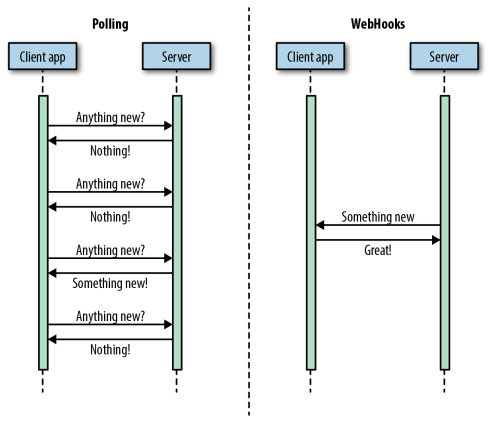

## Polling solution

### Some words about polling

Polling can be used when you don't need real-time updates, which cause frequent
changes in data and can crash your system if you decide to receive updates every
single time something changes.

  

As you can see, polling take much more bandwidth than his cousin webhooks. This
is the reason why we prefer to think at webhooks when we have a realtime
problem. But the solution can be adopted if you don't care about speed and timing.

A famous tool used today in production use polling, maybe you now git? If
you're interested about how git http servers work today, have a look on their
protocol! [git-http-protocol](https://www.git-scm.com/docs/http-protocol)

Basically, to clone or fetch data from a git repository with a smart server,
a classic conversation looks like:

C: what do you have?
S: those heads
C: Give me that head from here
S: Ok, here it is

By repeating the step multiple times, you can hope to bootstrap a database in
realtime. But you need to include the concept of `HEAD` in the DB.

### Head

The concept of `HEAD` is a requirement to poll a database running in
production. The head of the database can be a checksum of any entry in the
database, a timestamp of the latest modification, a slot of modifications,
or anything that permit the check of data coherency between 2 versions, and
get a diff.

The head track an history of modifications. Each time the DB is updated, the
head move and if we can't recompute the diff in a reasonable time, we store the
modification in cache too. In the chart here, a client is about to bootstrap
the database. But between the first ask, and the send of a chunk, there is no
guaranty that database hasn't been updated. So the we need to send also
_diff(head_asked, db_head)_, and the new _head_ before asking another chunk.

We will see in the solution, why the client has to be fast.

### Solution

Waiting for the snippet implementation

<b>[&larr; webhook](webhook.md)</b>
